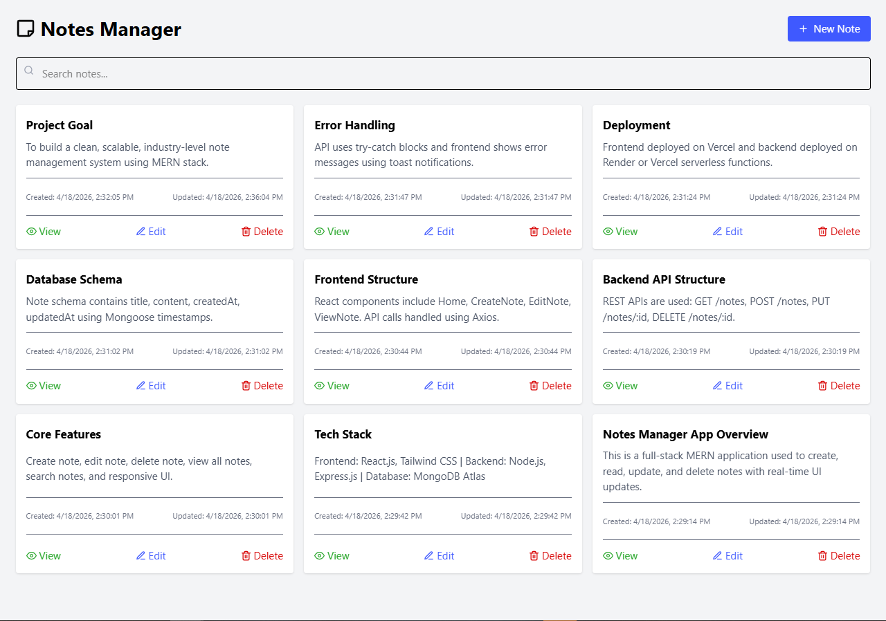

# 📝 Notes Manager App

A full-stack Notes Manager application built using the MERN stack.
Users can create, edit, delete, search, and manage their notes efficiently with a clean and responsive UI.

---

## 🌐 Live Demo

🚧 Frontend:https://notesmanagementsystem.netlify.app/  
🚧 Backend: https://notes-management-system-maoxy77gl-shreyashj9600s-projects.vercel.app/

## 🚀 Features

- ✍️ Create Notes
- 📖 View Notes
- ✏️ Edit Notes
- 🗑️ Delete Notes
- 🔍 Search Notes
- 🔔 Toast Notifications
- 📱 Responsive UI
- ⚡ Fast and lightweight

---

## 🛠️ Tech Stack

### Frontend

- React.js
- React Router
- Tailwind CSS
- Axios
- React Toastify

### Backend

- Node.js
- Express.js
- MongoDB
- Mongoose

---

## 📁 Project Structure

```
client/
 ├── src/
 │   ├── pages/
 │   ├── components/
 │   ├── services/
 │   └── App.jsx

server/
 ├── config/
 ├── models/
 ├── routes/
 ├── controllers/
 └── server.js
```

---

## ⚙️ Installation & Setup

### 1️⃣ Clone the repository

```
git clone https://github.com/Shreyashj9600/notes-management-system
cd notes-manager
```

---

### 2️⃣ Setup Backend

```
cd server
npm install
```

Create `.env` file:

```
PORT=5000
MONGO_URI=your_mongodb_connection_string
```

Run backend:

```
npm run dev
```

---

### 3️⃣ Setup Frontend

```
cd client
npm install
```

Create `.env` file:

```
VITE_API_URL=http://localhost:5000/api/notes
```

Run frontend:

```
npm run dev
```

---

## 🔗 API Endpoints

| Method | Endpoint       | Description     |
| ------ | -------------- | --------------- |
| GET    | /api/notes     | Get all notes   |
| GET    | /api/notes/:id | Get single note |
| POST   | /api/notes     | Create note     |
| PUT    | /api/notes/:id | Update note     |
| DELETE | /api/notes/:id | Delete note     |

---

## 📸 Screenshots

 

---

## 🌐 Deployment

Frontend: netlify
Backend: Render 
Database: MongoDB Atlas

---

## 👨‍💻 Author

**Shreyash Jadhav**

- GitHub: https://github.com/Shreyashj9600/notes-management-system

---
 
